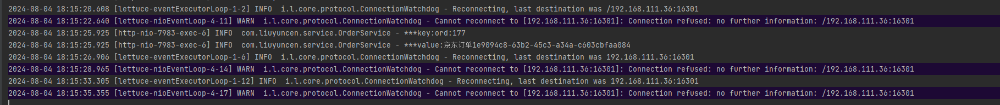
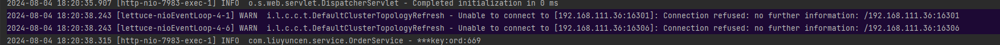

# Redis 系统学习笔记

通过继承 SpringBoot 实现各类业务，加强对 Redis 的掌握

项目构建于 [Bilibili 阳哥](https://www.bilibili.com/video/BV13R4y1v7sP) 特此感谢！


# 零基础篇

### Jedis 最早版本的 Redis 连接工具

[Jedis 操作 Redis 服务 代码案例](springboot-jedis-redis7/src/main/java/com/liuyuncen/demo/jedis/JedisDemo.java)

### 后续使用 Lettuce(生菜🥬)

Jedis 和 Lettuce 区别：Jedis 是单线程的，而 Lettuce 是多线程的。 SpringBoot 2.0 之后，默认使用 Lettuce, 是基于 Netty 的，性能更高。

[Lettuce 操作 Redis 服务 代码案例](springboot-jedis-redis7/src/main/java/com/liuyuncen/demo/lettuce/LettuceDemo.java)

### RedisTemplate【掌握】

RedisTemplate 自带一个 `lettuce-core` 所以，需要屏蔽或注释

#### 默认 RedisTemplate 接口会导致写入到 Redis 的 key 存在乱码问题，使用 StringRedisTemplate 解决

通过自定义 [RedisTemplate](springboot-jedis-redis7/src/main/java/com/liuyuncen/config/RedisConfig.java) 可以使得 Redis 写入的文件不是乱码，但是这样又有了新的 问题，写入的数据都带有 `“”` 双引号，在使用旧的没有双引号的数据读取时候，会报错。


#### SpringBoot 集成 RedisCluster 之后，无法感知 redis 主从节点情况

当手动关闭其中一条主节点之后，再发送请求，此时请求会卡顿一分钟，一分钟后返回请求。也就意味服务至少宕1分钟



添加配置 `adaptive: true` 之后，请求不会超过2秒立刻返回

```yaml
spring:
  redis:
    cluster:
      max-redirects: 3
      nodes:
        - 192.168.111.36:16301
        - 192.168.111.36:16302
        - 192.168.111.36:16303
        - 192.168.111.36:16304
        - 192.168.111.36:16305
        - 192.168.111.36:16306
    letture:
      cluster:
        refresh:
          period: 2000
          # 支持集群拓扑动态感知刷新 默认为 false，开启后，当主从节点发生变化后，随之改变
          adaptive: true
```




